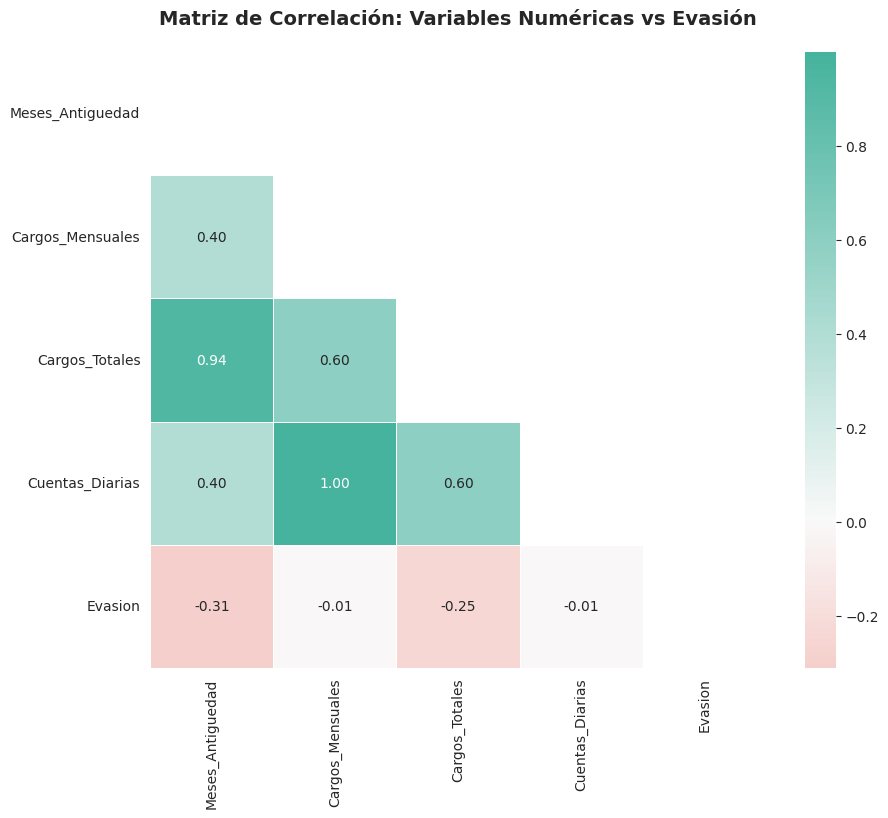
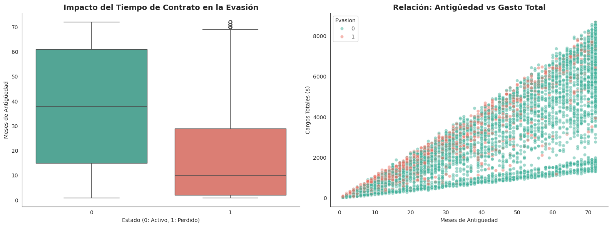
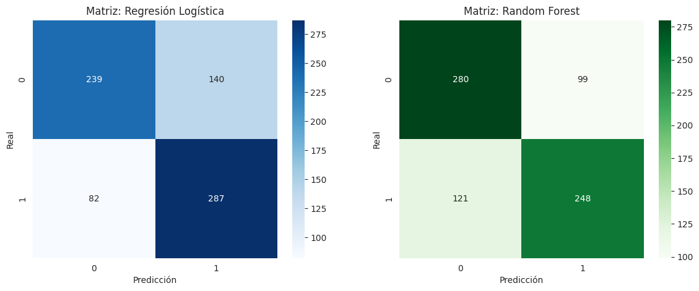
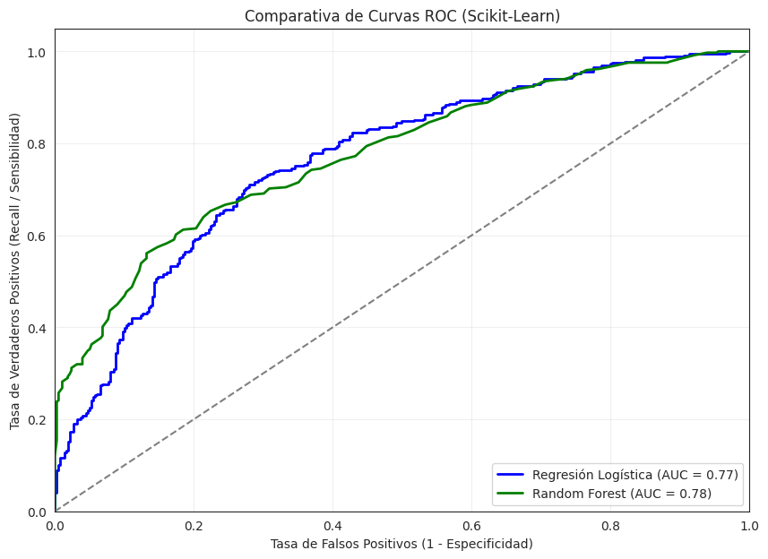
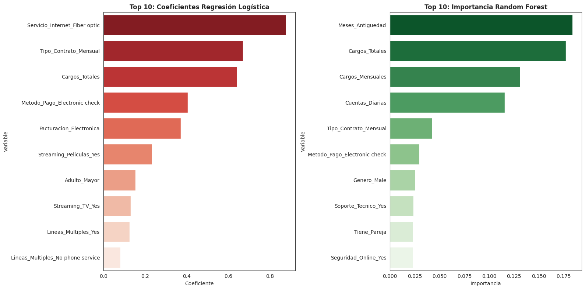

# TelecomX_LATAM-2

# 🏆 Estrategia Antipérdida de Clientes (Churn Prediction)

  
  
  

Este proyecto transforma datos complejos de telecomunicaciones en una herramienta predictiva estratégica. El objetivo es identificar clientes con alta probabilidad de abandono y proporcionar recomendaciones basadas en evidencia para optimizar la retención.

---

## 🛠️ Flujo de Trabajo Técnico

### 1. Ingeniería de Datos y Optimización
* **Selección de Variables:** Eliminación de `ID_Cliente` para evitar el sobreajuste y `Cuentas_Diarias` por multicolinealidad perfecta (1.0) con los cargos mensuales.
* **Transformación (Encoding):** Aplicación de **One-Hot Encoding** para convertir variables categóricas en numéricas, permitiendo al modelo asignar pesos específicos a cada tecnología o método de pago.
* **Estandarización:** Uso de `StandardScaler` para nivelar las magnitudes de variables como *Cargos Totales* y *Antigüedad*, garantizando una optimización eficiente del gradiente.

   
  
   
  <i>Figura 1: Diagnóstico de Multicolinealidad y Relevancia.</i>

### 2. Balanceo de Clases: NearMiss-3
Dado que solo el **26.6%** de la muestra representaba evasiones, se utilizó la técnica **NearMiss-3**. Esta versión selecciona registros de la clase mayoritaria que actúan como "vecinos" de los casos de fuga, forzando al modelo a aprender de los límites de decisión más difíciles.

---

## 🎯 Hallazgos y Análisis Dirigido

A través del cruce de variables críticas, identificamos que el **50% de las fugas ocurren antes de los 10 meses**. Los clientes se retiran antes de alcanzar su punto de rentabilidad óptima (LTV).

   
  
   
  <i>Figura 2: Relación entre Antigüedad, Gasto Total y Evasión.</i>

---

## 🧠 Modelado y Evaluación

Implementamos una estrategia de **Dualidad Algorítmica**:
1.  **Regresión Logística:** Elegido como modelo final por su alto **Recall (77.8%)**, priorizando la detección de desertores reales.
2.  **Random Forest:** Robusto ante relaciones no lineales, logrando un **AUC-ROC superior a 0.75**.

   
  
  
   
  <i>Figura 3: Comparativa de Rendimiento y Capacidad de Separación (Curva ROC).</i>

  <h3 style="color: #16a085; margin-top: 0;">🏆 Selección del Modelo Final</h3>
  
Tras evaluar ambos modelos, se recomienda el uso de la <b>Regresión Logística</b> para este problema de negocio.

  <ul style="color: #34495e;">
    <li><b>Justificación:</b> Su <b>Recall de 77.8%</b> garantiza que la empresa identificará a la gran mayoría de clientes en riesgo.</li>
    <li><b>Costo de Oportunidad:</b> Es más barato enviar una promoción de retención a alguien que no pensaba irse (Falso Positivo) que perder a un cliente real por no haberlo detectado a tiempo (Falso Negativo).</li>
  </ul>

---

## 🚀 Factores Determinantes (Feature Importance)

El análisis de los coeficientes revela tres pilares del abandono:
1.  **Fibra Óptica:** El mayor predictor de riesgo (Coef. ~0.9). Indica insatisfacción en este segmento técnico.
2.  **Fragilidad Mensual:** Los contratos de corto plazo facilitan la salida inmediata.
3.  **Barrera del Año:** La antigüedad es el mayor factor protector después de los 20 meses.

   
  
   
  <i>Figura 4: Variables más relevantes para la predicción de cancelación.</i>

---

## 💰 Conclusión y Estrategia de Retención

La **Curva de Ganancia Acumulada** confirma que contactando proactivamente al **30%** de los clientes con mayor riesgo, podemos capturar hasta el **70%** de las cancelaciones totales.

### Recomendaciones de Oro:
* **Auditoría de Fibra:** Revisar calidad y precio del servicio de fibra óptica.
* **Conversión Contractual:** Incentivar el paso de contratos mensuales a anuales.
* **Programa de 1er Año:** Acciones de fidelización intensivas en los meses críticos 6, 9 y 12.

---

## 📂 Estructura del Proyecto
* `notebook_analisis.ipynb`: Flujo completo de código.
* `modelo_fuga_clientes.pkl`: Modelo entrenado listo para producción.
* `escalador_datos.pkl`: Escalador para normalizar nuevos datos.
* `clientes_prueba.csv`: Datos procesados para validación.

---
**Autor:** Jorge Rodriguez - [LinkedIn](https://www.linkedin.com/in/jorg-rodriguez/)  
**Fecha:** Marzo 2026
